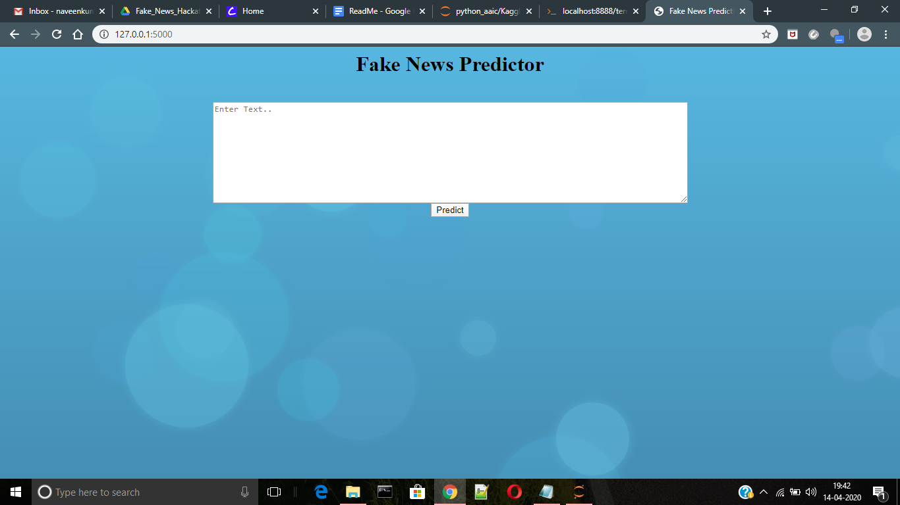

# FakeNewsPrediction

Note: I didn't uploaded some files(datasets, pickle files). 

Demo Video: https://www.youtube.com/watch?v=wVUNTGIk9Zg

For this project, the data is collected from multiple datasets from kaggle.com. Links for all the datasets are provided in Data_Preperation/Data_Preperation.ipynb
Steps to run this project:
1. Download all the datasets and store them in the Data_Preperation folder.(Links for all the datasets are provided in Data_Preperation/Data_Preperation.ipynb file)
2. After downloading datasets, rename them as Train1, Train2, Train3, Train4_1, Train4_2, Train5.
3. Run the Data_Preperation.ipynb upto last cell. This notebook will make changes to all the datasets and creates a new file 'final_data.csv' and stores it in the Data_Preperation folder. The final_data.csv contains the data from all the datasets. 
4. Now run the 'model.ipynb' in the repository. This file uses data from the 'final_data.csv'. This 'model.ipynb' file creates 2 files: "Classifier.pkl", "Vectorizer.pkl" and stores those files in 'Deployment' folder.

5. Finally open the 'Deployment' folder and run the 'app.py' fine from the 'command prompt/terminal'. The app.py uses 'classifier.pkl', 'vectorizer.pkl', 'templates/main.html' and 'static/background.png'

Once the app.py is ran in the terminal, it gives a localhost address. http://127.0.0.1:5000/. Open this address in the browser. This opens a web page. 

